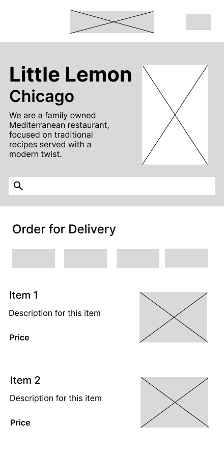

## Little Lemon Restaurant App: A Capstone Project in iOS Development

This is the culmination of iOS development certificate courses offered by Meta. I utilized Figma for the design planning phase, and Git and GitHub ensured smooth workflow management.

The project commenced with developing the onboarding flow, allowing users to create their accounts. Subsequently, I focused on establishing the navigation flow. Afterward, I worked on integrating data fetching from an API and storing it locally on the mobile device using Core Data. This enabled users to interact with the application even without internet connectivity.

Furthermore, I implemented sorting and filtering functionalities for food items, which introduced additional complexity but ultimately simplified the user experience.

## Wireframe

